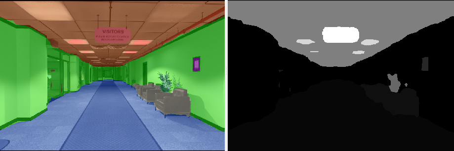
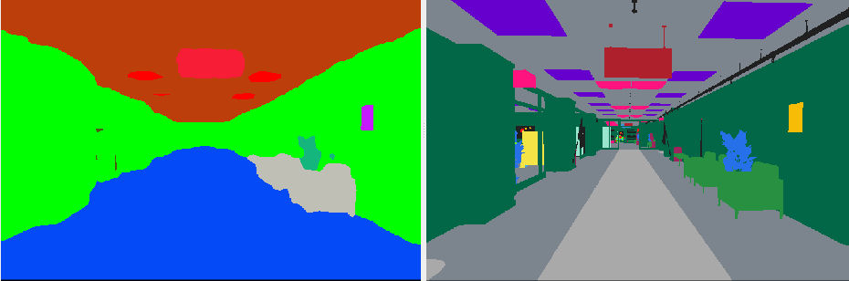
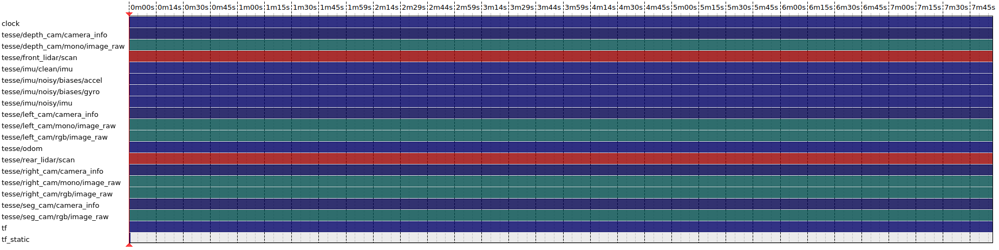

# semantic_inference
A ros1 version of semantic inference package (new version).

<div align="center">
   
   
</div>

This repository provides code for running inference on images with pre-trained models to provide both closed and open-set semantics.
Closed-set and open-set segmentation are implemented as follows:
  - Inference using dense 2D closed-set semantic segmentation models is implemented in c++ using TensorRT
  - Inference using open-set segmentation models and language features is implemented in python

Both kinds of semantic segmentation have a ROS interface associated with them, split between c++ and python as appropriate.

## Getting started
### Requirements
This package has been tested on ubuntu 20.04 with ros noetic, cuda-12.1 and tensrort-8.6.1.

### Making a workspace
First, make sure rosdep is setup:
```bash
# Initialize necessary tools for working with ROS and catkin
sudo apt install python3-catkin-tools python3-rosdep
sudo rosdep init
rosdep update
```
To start, clone this repository into your catkin workspace and run rosdep to get any missing dependencies.
This usually looks like the following:
```bash
mkdir -p ~/semantic_inference_ws/src
cd semantic_inference_ws
catkin init
catkin config -DCMAKE_BUILD_TYPE=Release
cd ~/semantic_inference_ws/src
git clone git@github.com:ArghyaChatterjee/semantic_inference.git
rosdep install --from-paths . --ignore-src -r -y
catkin build
```

Semantic Inference package depends on [config_utilities](https://github.com/MIT-SPARK/config_utilities) package. You need to clone that package inside your `~/semantic_inference_ws/src` before building the `semantic_inference` package.

Once you've added these repository to your workspace, follow one (or both) of the following setup-guides as necessary:
- [Closed-Set](docs/closed_set.md#setting-up)
- [Open-Set](docs/open_set.md#setting-up)

### Downloads
Download a single scene (the office scene without humans is recommended, and can be found [here](https://drive.google.com/uc?id=1CA_1Awu-bewJKpDrILzWok_H_6cOkGDb). The file is around ~16.8 GBs.

<div align="center">
    
</div>

Here are the topics from rosbag:
```
$ rosbag info uHumans2_office_s1_00h.bag 
path:         uHumans2_office_s1_00h.bag
version:      2.0
duration:     8:26s (506s)
start:        Dec 31 1969 18:00:11.40 (11.40)
end:          Dec 31 1969 18:08:37.55 (517.55)
size:         15.7 GB
messages:     742621
compression:  bz2 [33230/33230 chunks; 38.68%]
uncompressed: 40.4 GB @ 81.8 MB/s
compressed:   15.6 GB @ 31.6 MB/s (38.68%)
types:        geometry_msgs/Vector3Stamped [7b324c7325e683bf02a9b14b01090ec7]
              nav_msgs/Odometry            [cd5e73d190d741a2f92e81eda573aca7]
              rosgraph_msgs/Clock          [a9c97c1d230cfc112e270351a944ee47]
              sensor_msgs/CameraInfo       [c9a58c1b0b154e0e6da7578cb991d214]
              sensor_msgs/Image            [060021388200f6f0f447d0fcd9c64743]
              sensor_msgs/Imu              [6a62c6daae103f4ff57a132d6f95cec2]
              sensor_msgs/LaserScan        [90c7ef2dc6895d81024acba2ac42f369]
              tf2_msgs/TFMessage           [94810edda583a504dfda3829e70d7eec]
topics:       /clock                             10151 msgs    : rosgraph_msgs/Clock         
              /tesse/depth_cam/camera_info        8307 msgs    : sensor_msgs/CameraInfo      
              /tesse/depth_cam/mono/image_raw     8307 msgs    : sensor_msgs/Image           
              /tesse/front_lidar/scan            16962 msgs    : sensor_msgs/LaserScan       
              /tesse/imu/clean/imu              101213 msgs    : sensor_msgs/Imu             
              /tesse/imu/noisy/biases/accel     101150 msgs    : geometry_msgs/Vector3Stamped
              /tesse/imu/noisy/biases/gyro      101150 msgs    : geometry_msgs/Vector3Stamped
              /tesse/imu/noisy/imu              101212 msgs    : sensor_msgs/Imu             
              /tesse/left_cam/camera_info         8307 msgs    : sensor_msgs/CameraInfo      
              /tesse/left_cam/mono/image_raw      8307 msgs    : sensor_msgs/Image           
              /tesse/left_cam/rgb/image_raw       8307 msgs    : sensor_msgs/Image           
              /tesse/odom                       101213 msgs    : nav_msgs/Odometry           
              /tesse/rear_lidar/scan             16962 msgs    : sensor_msgs/LaserScan       
              /tesse/right_cam/camera_info        8307 msgs    : sensor_msgs/CameraInfo      
              /tesse/right_cam/mono/image_raw     8307 msgs    : sensor_msgs/Image           
              /tesse/right_cam/rgb/image_raw      8307 msgs    : sensor_msgs/Image           
              /tesse/seg_cam/camera_info          8307 msgs    : sensor_msgs/CameraInfo      
              /tesse/seg_cam/rgb/image_raw        8307 msgs    : sensor_msgs/Image           
              /tf                               109537 msgs    : tf2_msgs/TFMessage          
              /tf_static                             1 msg     : tf2_msgs/TFMessage

```
The rosbag is `bz2` compressed and has a size of `16.8 GB`. After decompression, the rosbag will have a size of `43.4 GB`. So you need to have a total size of `60.2 GB` left in your pc for the whole operation. Decompress the rosbag in the following way:
```
$ rosbag decompress uHumans2_office_s1_00h.bag
```
If you don't decompress the rosbag before playing it, it will require additional CPU cycles to decompress the data while reading it. The decompression can be CPU-intensive, especially with BZ2, which is known for high compression ratios but slower decompression speeds.s

## Usage

More details about including these 2 sets in bigger project can be found in the [closed-set](docs/closed_set.md#using-closed-set-segmentation-online) and [open-set](docs/open_set.md#using-open-set-segmentation-online) documentation.

Now, launch the semantic segmentation inference node in the following way:
```
roslaunch semantic_inference_ros semantic_inference.launch
```
Since in the launch file, the subscribed topic is already remapped from `/semantic_inference/color/image_raw` to `/tesse/left_cam/rgb/image_raw`. Play the rosbag:
```
rosbag play ~/uHumans2_office_s1_00h.bag --clock 
```

If not, here is how you can play the rosbag while remapping:
```
rosbag play ~/uHumans2_office_s1_00h.bag --clock /tesse/left_cam/rgb/image_raw:=/semantic_inference/color/image_raw
```

List of ros topics being published:
```
/semantic_inference/semantic/image_raw
...
/semantic_inference/semantic_color/image_raw
...
/semantic_inference/semantic_overlay/image_raw
...
```
List of ros topics being subscribed:
``` 
/semantic_inference/color/image_raw
```

List of ros nodes being published:
```
/nodelet_manager
/rosout
/semantic_inference
```

List of ros topics `/semantic_inference` node is publishing:
```
 * /rosout [rosgraph_msgs/Log]
```
List of ros topics `/semantic_inference` node is subscribing:
```
Subscriptions: None
```
List of ros topics `/nodelet_manager` node is subscribing:
``` 
 * /semantic_inference/color/image_raw [unknown type]
```
List of ros topics `/nodelet_manager` node is publishing:
```
 * /rosout [rosgraph_msgs/Log]
 * /semantic_inference/semantic/image_raw [sensor_msgs/Image]
 * /semantic_inference/semantic/image_raw/compressed [sensor_msgs/CompressedImage]
 * /semantic_inference/semantic/image_raw/compressed/parameter_descriptions [dynamic_reconfigure/ConfigDescription]
 * /semantic_inference/semantic/image_raw/compressed/parameter_updates [dynamic_reconfigure/Config]
 * /semantic_inference/semantic/image_raw/compressedDepth [sensor_msgs/CompressedImage]
 * /semantic_inference/semantic/image_raw/compressedDepth/parameter_descriptions [dynamic_reconfigure/ConfigDescription]
 * /semantic_inference/semantic/image_raw/compressedDepth/parameter_updates [dynamic_reconfigure/Config]
 * /semantic_inference/semantic/image_raw/theora [theora_image_transport/Packet]
 * /semantic_inference/semantic/image_raw/theora/parameter_descriptions [dynamic_reconfigure/ConfigDescription]
 * /semantic_inference/semantic/image_raw/theora/parameter_updates [dynamic_reconfigure/Config]
 * /semantic_inference/semantic_color/image_raw [sensor_msgs/Image]
 * /semantic_inference/semantic_color/image_raw/compressed [sensor_msgs/CompressedImage]
 * /semantic_inference/semantic_color/image_raw/compressed/parameter_descriptions [dynamic_reconfigure/ConfigDescription]
 * /semantic_inference/semantic_color/image_raw/compressed/parameter_updates [dynamic_reconfigure/Config]
 * /semantic_inference/semantic_color/image_raw/compressedDepth [sensor_msgs/CompressedImage]
 * /semantic_inference/semantic_color/image_raw/compressedDepth/parameter_descriptions [dynamic_reconfigure/ConfigDescription]
 * /semantic_inference/semantic_color/image_raw/compressedDepth/parameter_updates [dynamic_reconfigure/Config]
 * /semantic_inference/semantic_color/image_raw/theora [theora_image_transport/Packet]
 * /semantic_inference/semantic_color/image_raw/theora/parameter_descriptions [dynamic_reconfigure/ConfigDescription]
 * /semantic_inference/semantic_color/image_raw/theora/parameter_updates [dynamic_reconfigure/Config]
 * /semantic_inference/semantic_overlay/image_raw [sensor_msgs/Image]
 * /semantic_inference/semantic_overlay/image_raw/compressed [sensor_msgs/CompressedImage]
 * /semantic_inference/semantic_overlay/image_raw/compressed/parameter_descriptions [dynamic_reconfigure/ConfigDescription]
 * /semantic_inference/semantic_overlay/image_raw/compressed/parameter_updates [dynamic_reconfigure/Config]
 * /semantic_inference/semantic_overlay/image_raw/compressedDepth [sensor_msgs/CompressedImage]
 * /semantic_inference/semantic_overlay/image_raw/compressedDepth/parameter_descriptions [dynamic_reconfigure/ConfigDescription]
 * /semantic_inference/semantic_overlay/image_raw/compressedDepth/parameter_updates [dynamic_reconfigure/Config]
 * /semantic_inference/semantic_overlay/image_raw/theora [theora_image_transport/Packet]
 * /semantic_inference/semantic_overlay/image_raw/theora/parameter_descriptions [dynamic_reconfigure/ConfigDescription]
 * /semantic_inference/semantic_overlay/image_raw/theora/parameter_updates [dynamic_reconfigure/Config]
```


